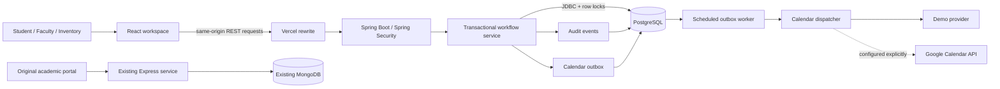

# CampusFlow

**Less chasing. More campus life.**

[Open the live demo](https://campusflow-ops.vercel.app) · [Try the operations workspace](https://campusflow-ops.vercel.app/ops) · [Deployment notes](docs/DEPLOYMENT.md)

The free service may need a minute to wake up. This temporary demo's free PostgreSQL database expires on **11 October 2026**; see the deployment notes for hosting limits.

CampusFlow brings equipment requests, faculty decisions and inventory handoffs into one workspace. It extends the original academic portal with a Java / Spring Boot operations service, while preserving the separate Express / MongoDB application.

## Try the complete story

1. Open **Operations** and explore the sample equipment as a student.
2. Submit a request with a purpose, quantity and collection / return times.
3. Switch the demo role to **Faculty approver** and review the request.
4. Switch to **Inventory manager** to prepare equipment, record collection and confirm its return.
5. Open **Activity** to inspect the recorded handoffs.
6. In **Integrations**, simulate a calendar outage, approve a request, and retry its calendar job. The approval survives the outage; recovery updates the same job.

Each browser session receives a separate SQL workspace with sample people and inventory. The role switcher is intentionally a demonstration control, **not production campus authentication**. No signup or shared guest password is required. Sample workspaces expire after seven days and session cookies after one day.

## What makes the workflow reliable

- **Reservation correctness:** faculty approval locks the equipment row and checks peak simultaneous demand across half-open time intervals. Adjacent bookings can share capacity without being incorrectly counted together.
- **Physical stock checks:** equipment that is still checked out cannot be collected again, even if its original booking window has ended.
- **Explicit state transitions:** the API checks role, workspace and current status for every mutation. Invalid handoffs return a conflict rather than silently overwriting state.
- **Safe submission retries:** an `Idempotency-Key` returns the original request for an identical payload and rejects reuse with a different payload.
- **Atomic audit and outbox writes:** approval, its audit event and a pending calendar job commit together. A calendar outage cannot undo an approved booking.
- **Recoverable delivery:** a scheduled worker and manual retry reuse a deterministic calendar event ID. Failed jobs remain inspectable; successful jobs are not resent.
- **Accessible interface:** visible focus, labelled forms, keyboard-operable dialogs, reduced-motion support, responsive navigation and automated axe checks.

## Architecture

The operations service uses **Java 17, Spring Boot 3.5, Spring Security, REST, JDBC, SQL, Flyway and PostgreSQL**. Local development defaults to a separate H2 database in PostgreSQL compatibility mode. React, Material UI and the original campus illustration keep the interface connected to the existing project.

