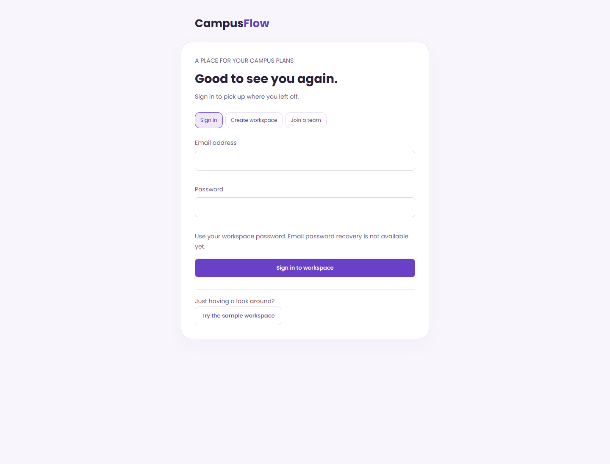
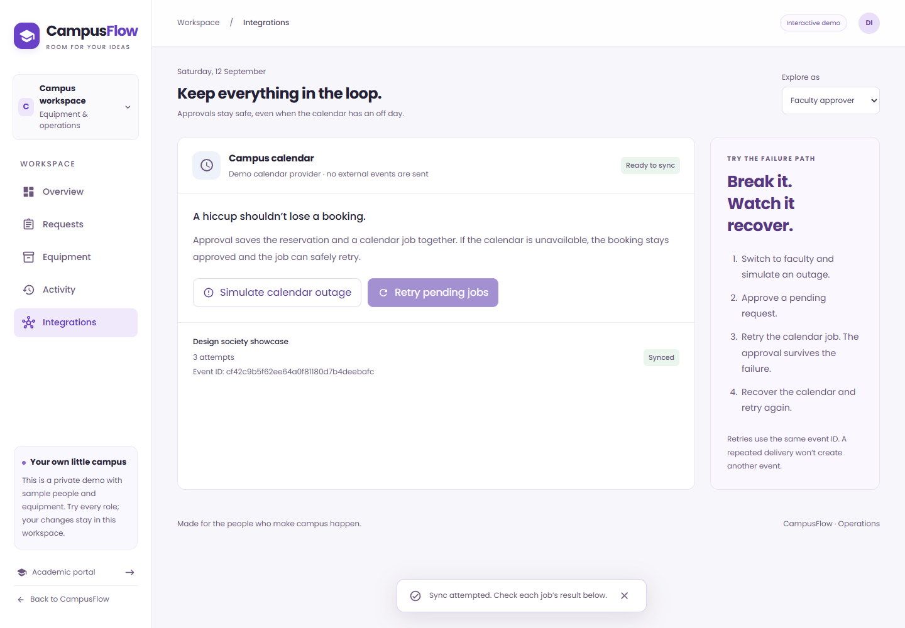
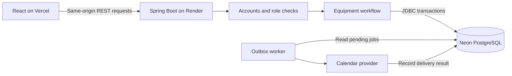

# CampusFlow

A campus equipment booking app for students, faculty and inventory teams.

CampusFlow keeps requests, approvals, collection and returns in one place. Students reserve equipment for a time slot, faculty review the request, and inventory staff handle the handoff. Every status change appears in the request history.

[Live demo](https://campusflow-ops.vercel.app) · [Sample workspace](https://campusflow-ops.vercel.app/ops) · [Sign in](https://campusflow-ops.vercel.app/ops/sign-in)

The backend runs on a free Render instance and may take about a minute to wake after inactivity.


## Equipment workflow

```text
Request → Approve → Prepare → Collect → Return
        ↘ Reject with a reason
```

Students can cancel their own pending requests. Faculty check the purpose and available capacity before approving. Inventory staff mark equipment ready, record collection and confirm its return.

- **Equipment catalogue:** search by name and filter by category.
- **Team workspaces:** create an account and invite teammates with student, faculty or inventory roles.
- **Saved bookings:** sign back in to the same workspace and request history.
- **Availability checks:** prevent conflicting approvals and account for equipment that has not been returned.
- **Request history:** record decisions and handoffs as part of each database transaction.
- **Calendar retries:** retain approved bookings when calendar delivery fails, with visible retry controls.
- **Accessible UI:** labelled forms, keyboard navigation, responsive layouts and reduced-motion support.

## Accounts and demo access

The sample workspace opens without registration. It contains fictional people and bookings, with a role selector for exploring each part of the workflow. Each sample workspace is isolated; demo sessions last one day and sample workspaces are cleaned up after seven days.

Creating an account starts a separate workspace with six equipment items and no fictional bookings. The owner can invite teammates from **Account** using a single-use code that expires after 48 hours. Invited members receive a fixed role; the owner can use all three roles. Account workspaces are kept when sample data is cleaned up.

Passwords are hashed with BCrypt. Sessions use HttpOnly cookies, and write requests require a CSRF token. [Account design](docs/ACCOUNTS.md)



## Screenshots

### Equipment catalogue


### Faculty review


<details>
<summary>Calendar failure and recovery</summary>

An approved booking remains saved when calendar delivery fails. Retrying updates the existing delivery job.




</details>

## Architecture



The backend is one Spring Boot application. PostgreSQL stores accounts, invitations, workspaces, equipment, requests, sessions, audit events and calendar jobs. Flyway manages schema changes.

Approval locks the equipment row and calculates peak reservations during the requested interval. Adjacent bookings can reuse capacity. Idempotency keys prevent duplicate request submissions. Approval, its audit event and the calendar job commit together; delivery happens separately through the outbox worker.

| Layer | Technologies |
| --- | --- |
| Frontend | React, JavaScript, Material UI, CSS |
| Backend | Java 17, Spring Boot, Spring Security, REST |
| Persistence | JDBC, PostgreSQL, Flyway; H2 for local development |
| Testing | JUnit, Spring Boot Test, Playwright, axe-core |
| Deployment | Docker, Render, Vercel, Neon, GitHub Actions |

[Detailed workflow diagram](docs/social/campusflow-workflow.png) · [Deployment and migration notes](docs/DEPLOYMENT.md)

## Run locally

Requirements: **Java 17+** and **Node.js 22**. The included Maven wrapper downloads Maven on its first run. No database account is required for local development.

Clone the repository and install dependencies:

```sh
git clone https://github.com/Sammmmsh/CampusFlow.git
cd CampusFlow
npm ci
npm --prefix frontend ci
```

Start the API in one terminal:

```sh
cd ops-service
./mvnw spring-boot:run
```

On Windows PowerShell, use `.\mvnw.cmd spring-boot:run` from `ops-service`.

In a second terminal, from the repository root:

```sh
npm run dev:web
```

Open **http://localhost:3000/ops** for the sample workspace or **http://localhost:3000/ops/sign-in** for accounts. The frontend proxies API requests to port **8080**. Local data is stored in an H2 file under `ops-service/.runtime/` and survives an ordinary restart.

To use PostgreSQL locally, set `JDBC_DATABASE_URL`, `DATABASE_USERNAME` and `DATABASE_PASSWORD` before starting Java. Available settings are listed in [ops-service/.env.example](ops-service/.env.example); Spring Boot reads environment variables and does not load that file automatically.

## Tests

Run backend tests from `ops-service`:

```sh
./mvnw test
```

On Windows, use `.\mvnw.cmd test`.

With the frontend and API running, run browser tests from the repository root:

```sh
npx playwright install chrome
npm run test:e2e
```

The suite contains **25 Java tests** and **15 browser tests**, covering account invitations, permissions, saved bookings, concurrent approvals, duplicate submissions, late returns and calendar recovery. GitHub Actions runs backend checks against PostgreSQL 18. Browser checks include mobile layouts, keyboard interaction and automated accessibility scans.

[CI runs](https://github.com/Sammmmsh/CampusFlow/actions)

## Original academic portal

The repository also includes the original React/Express/MongoDB application for classes, attendance, results, notices and complaints. Its Express backend is in `backend/`; the equipment operations API is in `ops-service/`.

The academic backend is separate from the public operations deployment. Running the equipment workflow does not require it, and the PostgreSQL migration does not modify its MongoDB data.

## Current limitations

- Email verification, forgotten-password recovery, university SSO and member removal are not implemented.
- Calendar delivery uses a simulator. The optional Google Calendar adapter requires separate credentials and has no automatic OAuth token refresh.
- Workspaces are capped at 200 requests. An archive and administration workflow is needed for longer-term use.
- Idle calendar polling pauses to let Neon suspend; pending delivery resumes with API activity or a manual retry. Hosting remains subject to provider quotas and availability.
- The inherited frontend dependency tree has unresolved audit advisories. The academic backend needs further authentication work before public deployment.
