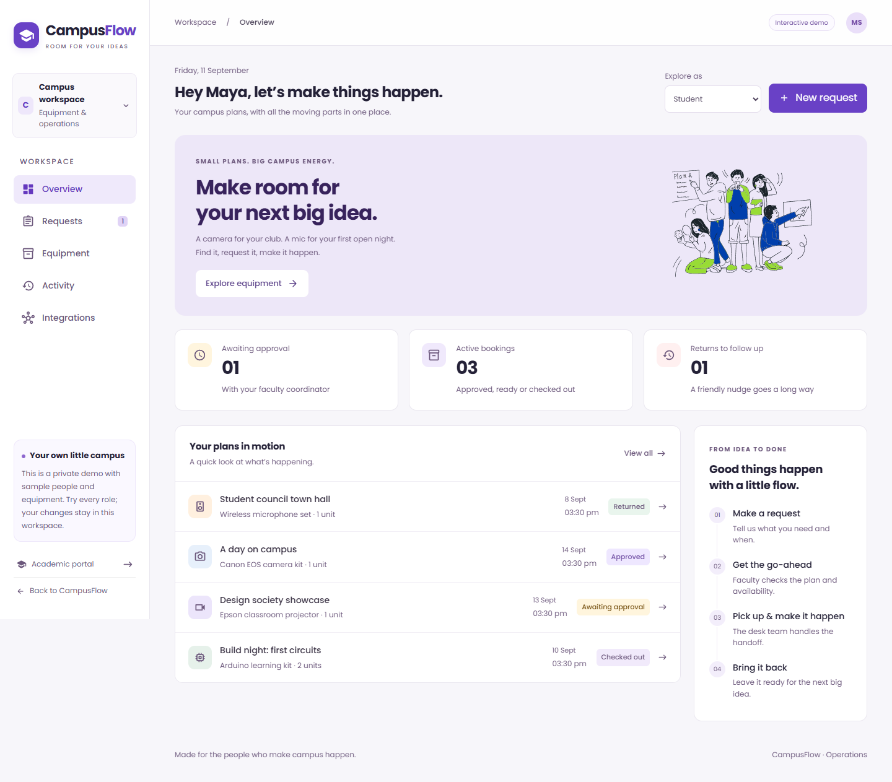
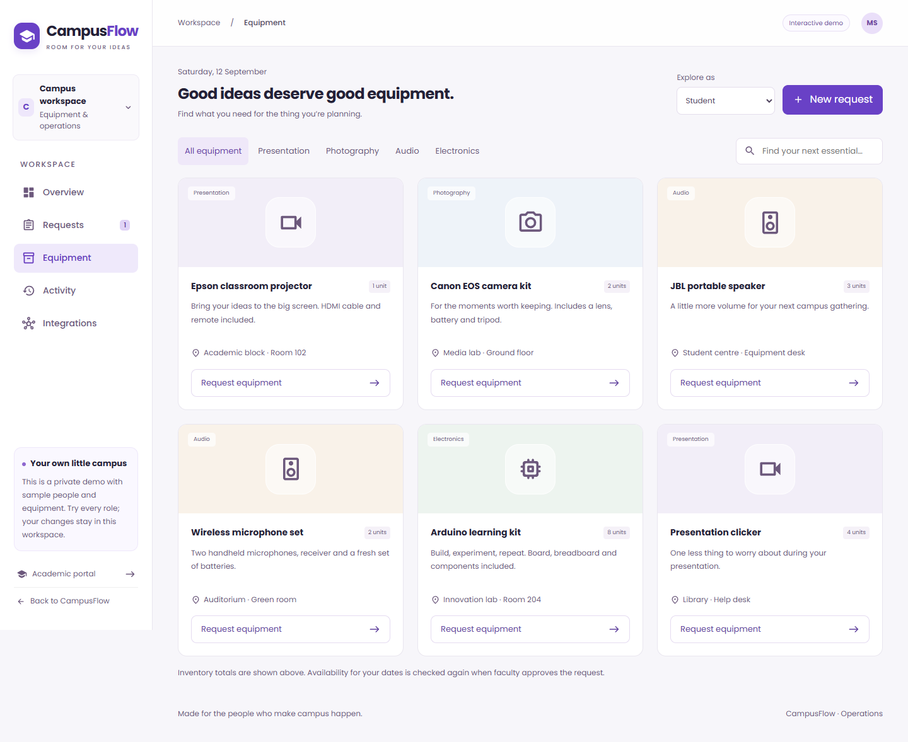
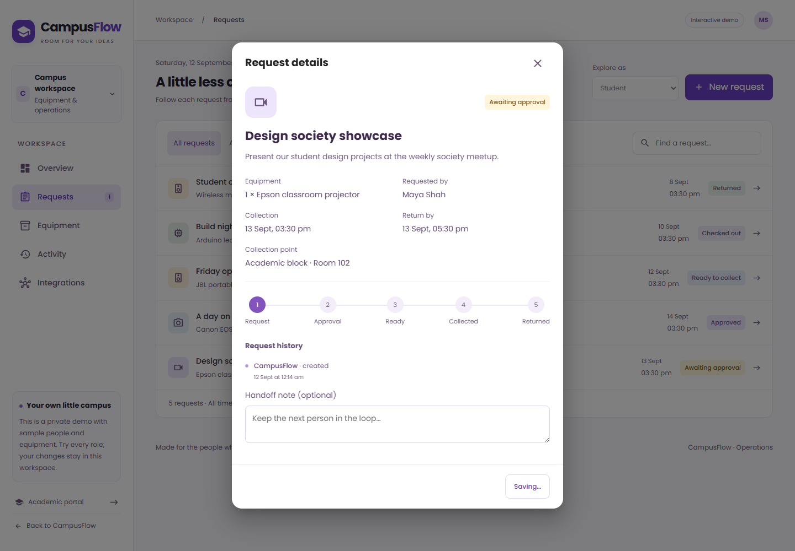
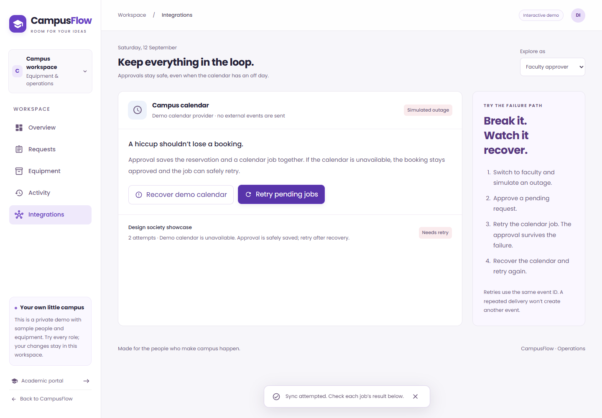
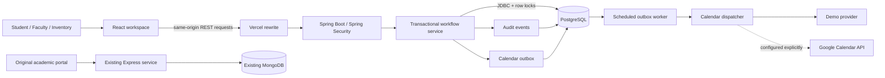
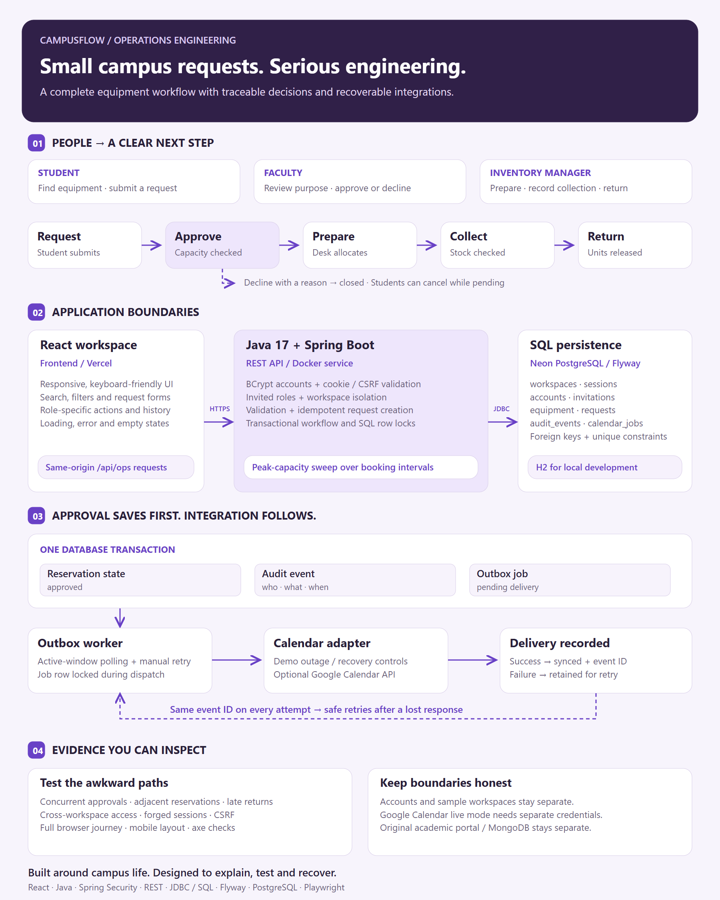

# CampusFlow

**Less chasing. More campus life.**

[Open the live demo](https://campusflow-ops.vercel.app) · [Try the operations workspace](https://campusflow-ops.vercel.app/ops) · [Deployment notes](docs/DEPLOYMENT.md)

The free service may need a minute to wake up. This temporary demo's free PostgreSQL database expires on **11 October 2026**; see the deployment notes for hosting limits.

CampusFlow brings equipment requests, faculty decisions and inventory handoffs into one workspace. It extends the original academic portal with a Java / Spring Boot operations service, while preserving the separate Express / MongoDB application.



## Equipment workflow

1. Open **Operations** and explore the sample equipment as a student.
2. Submit a request with a purpose, quantity and collection / return times.
3. Switch the demo role to **Faculty approver** and review the request.
4. Switch to **Inventory manager** to prepare equipment, record collection and confirm its return.
5. Open **Activity** to inspect the recorded handoffs.
6. In **Integrations**, simulate a calendar outage, approve a request, and retry its calendar job. The approval survives the outage; recovery updates the same job.

Each browser session receives a separate SQL workspace with sample people and inventory. The role switcher is intentionally a demonstration control, **not production campus authentication**. No signup or shared guest password is required. Sample workspaces expire after seven days and session cookies after one day.

## Workflow rules

- **Reservation correctness:** faculty approval locks the equipment row and checks peak simultaneous demand across half-open time intervals. Adjacent bookings can share capacity without being incorrectly counted together.
- **Physical stock checks:** equipment that is still checked out cannot be collected again, even if its original booking window has ended.
- **Explicit state transitions:** the API checks role, workspace and current status for every mutation. Invalid handoffs return a conflict rather than silently overwriting state.
- **Safe submission retries:** an `Idempotency-Key` returns the original request for an identical payload and rejects reuse with a different payload.
- **Atomic audit and outbox writes:** approval, its audit event and a pending calendar job commit together. A calendar outage cannot undo an approved booking.
- **Recoverable delivery:** a scheduled worker and manual retry reuse a deterministic calendar event ID. Failed jobs remain inspectable; successful jobs are not resent.
- **Accessible interface:** visible focus, labelled forms, keyboard-operable dialogs, reduced-motion support, responsive navigation and automated axe checks.







## Architecture



The operations service uses **Java 17, Spring Boot 3.5, Spring Security, REST, JDBC, SQL, Flyway and PostgreSQL**. Local development defaults to a separate H2 database in PostgreSQL compatibility mode. React, Material UI and the original campus illustration keep the interface connected to the existing project.

The original MongoDB database is neither migrated nor modified by the operations service. Its academic routes remain available, but require their original Express service and MongoDB configuration.

## Run locally

Requirements: Java 17+, Node.js 20+ and Maven 3.9+ (or the included Maven wrapper). Browser checks use Google Chrome.

```sh
# From the repository root
npm ci
npm --prefix frontend ci

# Terminal 1: build and start the operations API
cd ops-service
./mvnw clean package
java -jar target/ops-service-1.0.0.jar

# Terminal 2: from the repository root
npm run dev:web
```

On Windows, use `mvnw.cmd` in place of `./mvnw`. If your system's wrapper download is blocked, run the same goals with an installed Maven: `mvn clean package`.

Open **http://localhost:3000/ops**. The development proxy forwards `/api/ops` to **http://localhost:8080**. The original academic backend is optional for the operations demo and is not started by these commands.

### Use PostgreSQL

Create a **new, empty operations database** and export these environment variables before starting Java:

```dotenv
JDBC_DATABASE_URL=jdbc:postgresql://localhost:5432/campusflow_ops
DATABASE_USERNAME=campusflow
DATABASE_PASSWORD=your-local-database-password
APP_ORIGIN=http://localhost:3000
COOKIE_SECURE=false
DEMO_ENABLED=true
```

Spring Boot reads process environment variables; it does not automatically load `.env` files. `ops-service/.env.example` documents the settings. Flyway creates the operations schema on startup. Never point these settings at the original MongoDB service or an unrelated database.

## Verification

```sh
# Java integration tests (H2 by default)
cd ops-service
./mvnw test

# From the repository root, with both local services running
npm run test:e2e
npm run build

# Generate screenshots and the workflow diagram
npm run screenshots
node scripts/workflow.cjs
```

The Java suite checks lifecycle history, permissions, CSRF, cookie handling, workspace isolation, idempotency, simultaneous approvals, adjacent bookings, outstanding collections, input limits and calendar recovery. The browser suite exercises the full request-to-return journey, API permissions, outage recovery, search, mobile layout, dialog focus and accessibility scans.

`TEST_DATABASE_URL` switches the integration tests to a disposable PostgreSQL database; set `DATABASE_USERNAME` and `DATABASE_PASSWORD` for that database too. The CI workflow runs the Java suite against PostgreSQL and the browser suite against the local application. Test users and data are synthetic. Do not run this suite against a database containing real campus information.

Automated accessibility scans are useful regression checks, not a claim of comprehensive WCAG certification. Local verification details and deployment status are recorded in [the deployment guide](docs/DEPLOYMENT.md).

## API

| Operation                   | Endpoint                                                      | Demo role                               |
| --------------------------- | ------------------------------------------------------------- | --------------------------------------- |
| Start / read session        | `POST /api/ops/session`, `GET /api/ops/session`               | Public bootstrap / signed-in session    |
| Change demo role            | `POST /api/ops/session/role`                                  | Current demo session                    |
| Read workspace              | `GET /api/ops/dashboard`                                      | Any demo role                           |
| Submit request              | `POST /api/ops/requests`                                      | Student                                 |
| Approve / reject            | `POST /api/ops/requests/{id}/approve` or `/reject`            | Faculty                                 |
| Allocate / collect / return | `POST /api/ops/requests/{id}/allocate`, `/collect`, `/return` | Inventory                               |
| Cancel pending request      | `POST /api/ops/requests/{id}/cancel`                          | Requester                               |
| Simulate calendar outage    | `POST /api/ops/integrations/failure`                          | Faculty / inventory; demo calendar only |
| Retry delivery              | `POST /api/ops/integrations/retry`                            | Faculty / inventory                     |

Session bootstrap requires `X-CampusFlow: 1`. Subsequent writes require the synchronizer token returned by the session endpoint in `X-CSRF-Token`. Session tokens are opaque, stored hashed in SQL and sent in HttpOnly cookies. Production cookies must use `COOKIE_SECURE=true`.

Source files:

- [`Operations.js`](frontend/src/ops/Operations.js): state, accessible UI and role-specific actions.
- [`api.js`](frontend/src/ops/api.js): sessions, CSRF, timeouts and submission keys.
- [`WorkflowService.java`](ops-service/src/main/java/dev/campusflow/ops/WorkflowService.java): transactions, reservation algorithm and state machine.
- [`SecurityConfig.java`](ops-service/src/main/java/dev/campusflow/ops/SecurityConfig.java): origin, session and CSRF checks.
- [`CalendarDispatcher.java`](ops-service/src/main/java/dev/campusflow/ops/CalendarDispatcher.java): delivery, deterministic event IDs and recovery.
- [`V1__operations.sql`](ops-service/src/main/resources/db/migration/V1__operations.sql): schema, constraints and indexes.
- [`WorkflowIntegrationTest.java`](ops-service/src/test/java/dev/campusflow/ops/WorkflowIntegrationTest.java): executable examples of business rules.

## Integration boundaries

The default calendar is an explicit simulator, so exploring the public demo sends **no external calendar events**. A dedicated test Google Calendar can be enabled with `GOOGLE_CALENDAR_ID` and `GOOGLE_CALENDAR_ACCESS_TOKEN`. The token needs permission to create events and must be replaced when it expires; OAuth consent and token refresh are not implemented. The live Google provider must be verified with your own test credentials before use. Manual retries remain available after the worker's three automatic attempts.

The public demo caps workspace creation and requests, uses expiring sessions and keeps each workspace isolated. A real campus rollout still needs institutional identity / SSO, real user-to-role assignments, operator provisioning, rate limiting, monitoring, backup policies and a separately reviewed integration credential flow. Setting `DEMO_ENABLED=false` disables new demo sessions; it does not install an identity provider.

## Workflow diagram

[PNG](docs/social/campusflow-workflow.png) · [Editable SVG](docs/social/campusflow-workflow.svg) · [Deployment guide](docs/DEPLOYMENT.md)



The diagram describes the implemented workflow and its boundaries. Screenshots are captured from the running application with sample data, not design mockups.
